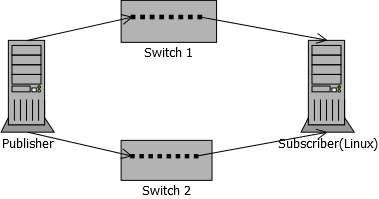

pdMcRoutingTest
---------------

This test checks, if incoming multicast messages are routed to the correct subscriber based
on the interface they are received on. 

To do this, two devices are connected to two different networks. Each device has two network
interfaces, one connected to switch 1 and one connected to switch 2.



On one Device two PD publishers are created, that publish over 2 different interfaces connected
to different networks using the same multicast address but different payloads. 
On the second device two PD subscribers are created, that subscribe to the telegrams sent from the
publishing device. The two subscribers use the different interfaces connected to the different networks.

The expected result is, that each subscriber should only receive telegrams from the publisher on the same
network, even if there is no other filter preventing them from receiving the incoming messages from the
other network (e.g. if there was source filtering active or if the comIds were different).

To launch the test, run the following command on the devices:

```bash
Publisher:
pdMcRouting -p -f <first-ip-address> -s <second-ip-address> [-c <comId> -m <multicast-address>]
Subscriber:
pdMcRouting -f <first-ip-address> -s <second-ip-address> [-c <comId> -m <multicast-address>]
```

Example
 -p -f 192.168.1.30 -s 10.0.1.31 -m 239.0.1.1 -c 10001 
    -f 192.168.1.26 -s 10.0.1.1 -m 239.0.1.1 -c 10001 
	
correct if output:
"Data correctly received session 1"
"Data correctly received session 2"

--> runs forever

